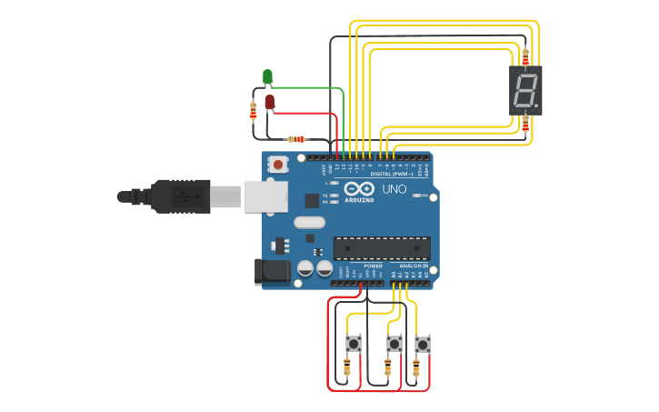
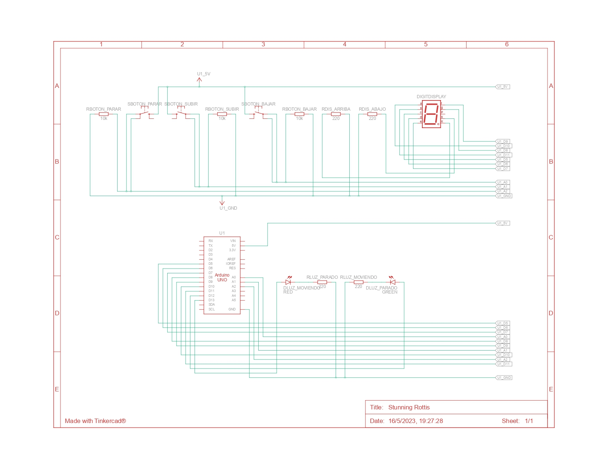

# SPD-Examen-Montacargas

## Examen: Montacargas

## objetivo del proyecto
El objetivo de este proyecto es realizar el "menu" interactivo de un montaargas el cual debe subir pisos y bajarlos uno a la vez.
## Funcionamiento
para su funcionamiento se divide en diferentes partes las cuales son las siguientes:
* Configuracion y definicion de variables
* Loop y funciones pincipales
* Entrada de datos
* Funciones para apagado y prendido de leds

### Configuracion inicial y definicion de variables
aqui se establecen los puertos utilizados asignadoles una denominacion, se inicializan las variables y se establece la configuacion inicial indicando la modalidad de cada puerto como el estado de dichos puertos
* Establecimiento de puertos
~~~~
#define BOTON_PARAR 16
#define BOTON_SUBIR 15
#define BOTON_BAJAR 14
#define	LUZ_MOVIENDO 13
#define	LUZ_PARADO 12
#define	ABAJO_DERECHA 5
#define	ABAJO 6
#define	ABAJO_IZQUIERDA 7
#define	CENTRO 8
#define	ARRIBA_IZQUIERDA 9
#define	ARRIBA 10
#define	ARRIBA_DERECHA 11
~~~~
* Inicializacion de variables
~~~~
int bandera_emergencia = LOW;
int bandera_emergencia_moviendo = LOW;
int piso = 0;
long contador = 0;
~~~~
* Configuracion Inicial
~~~~
void setup()
{
  pinMode(BOTON_PARAR, INPUT);
  pinMode(BOTON_SUBIR, INPUT);
  pinMode(BOTON_BAJAR, INPUT);
  pinMode(LUZ_MOVIENDO, OUTPUT);
  pinMode(LUZ_PARADO, OUTPUT);
  pinMode(ABAJO_DERECHA, OUTPUT);
  pinMode(ABAJO, OUTPUT);
  pinMode(ABAJO_IZQUIERDA, OUTPUT);
  pinMode(CENTRO, OUTPUT);
  pinMode(ARRIBA_IZQUIERDA, OUTPUT);
  pinMode(ARRIBA, OUTPUT);
  pinMode(ARRIBA_DERECHA, OUTPUT);
  prende_numero_cero();
  prende_led(LUZ_PARADO);
  Serial.begin(9600);
  Serial.println("Usted se encuentra en el piso: 0");
}
~~~~

### Loop y funciones pincipales
Dentro del loop se encuenta el codigo que se ejecuta continuamente y luego las funciones pincipales las cuales son las mas importantes.

* Loop
~~~~
void loop()
{
    bandera_emergencia = emergencia(bandera_emergencia);

    if (bandera_emergencia == LOW){
        montacargas();
    }
}
~~~~
#### funciones principales

* Funciones para el paro de emegencia
~~~~
int emergencia(int bandera){
    if( (digitalRead(BOTON_PARAR) == HIGH) && (bandera == HIGH)){
        bandera = LOW;
      	contador = contador + millis();
      	Serial.println("Parada de emergencia desactivada");
      	delay(150);
    }
  	else if (digitalRead(BOTON_PARAR) == HIGH){
        bandera = HIGH ;
      	contador = contador - millis();
      	Serial.println("Parada de emergencia activada, por favor contacte con mantenimiento");
    	delay(150);
    }
  	
  	return bandera;
}

void movimiento(){
   contador = (millis() + 3000);
   while(contador >= millis()){
     bandera_emergencia_moviendo = emergencia(bandera_emergencia_moviendo);
     while (bandera_emergencia_moviendo == HIGH){
        bandera_emergencia_moviendo = emergencia(bandera_emergencia_moviendo);
     	delay(100);
      }
   }
~~~~ 
* Funcion para mover el montacargas
~~~~
void montacargas(){
  if(digitalRead(BOTON_BAJAR) == HIGH|| digitalRead(BOTON_SUBIR) == HIGH){
      	control_movimiento();
    	Serial.print("Usted se encuentra en el piso: ");
    	Serial.println(piso);
     	instrucciones_segun_numero();
  }
}
~~~~
### Funciones logicas y procesamiento de datos
~~~~          
//funciones logicas para funcionamiento
void instrucciones_segun_numero(){
    switch (piso)
    {
      case (0):
        apaga_numero_uno();
        prende_numero_cero();
        break;
      case (1):
        apaga_numero_cero();
        apaga_numero_dos();
        prende_numero_uno();
        break;
      case (2):
        apaga_numero_uno();
        apaga_numero_tres();
        prende_numero_dos();
        break;
      case (3):
        apaga_numero_dos();
        apaga_numero_cuatro();
        prende_numero_tres();
        break;    
      case (4):
        apaga_numero_tres();
        apaga_numero_cinco();
        prende_numero_cuatro();
        break;
      case (5):
        apaga_numero_cuatro();
        apaga_numero_seis();
        prende_numero_cinco();
        break;
      case (6):
        apaga_numero_cinco();
        apaga_numero_siete();
        prende_numero_seis();
        break;
      case (7):
        apaga_numero_seis();
        apaga_numero_ocho();
        prende_numero_siete();
        break;
      case (8):
        apaga_numero_siete();
        apaga_numero_nueve();
        prende_numero_ocho();
        break;
      case (9):
        apaga_numero_ocho();
        prende_numero_nueve();
        break;
    }
}

void control_movimiento(){
    if ( (digitalRead(BOTON_SUBIR) == HIGH) || (digitalRead(BOTON_BAJAR) == HIGH)){
        apaga_led(LUZ_PARADO);
        prende_led(LUZ_MOVIENDO);
        subir_piso();
        bajar_piso();
		movimiento();
        apaga_led(LUZ_MOVIENDO);
        prende_led(LUZ_PARADO);
    }
}
~~~~ 

### Entrada de datos
~~~~ 
//entrada de datos
void subir_piso(){
    if ( (digitalRead(BOTON_SUBIR) == HIGH) && (piso != 9)){
      	Serial.println("Subiendo..");
        piso++;
    }
}
void bajar_piso(){
    if ( (digitalRead(BOTON_BAJAR) == HIGH) && (piso != 0)){
      	Serial.println("Bajando..");
        piso--;
    }
}
~~~~ 
### Funciones para apagado y prendido de leds
~~~~ 

//funciones para apagar y prender led-->>
void apaga_led(int led){
  digitalWrite(led, LOW);
}
void prende_led(int led){  	
	digitalWrite(led, HIGH);
}
void prende_numero_cero(){
  prende_led(ARRIBA);
  prende_led(ARRIBA_DERECHA);
  prende_led(ARRIBA_IZQUIERDA);
  prende_led(ABAJO_DERECHA);
  prende_led(ABAJO_IZQUIERDA);
  prende_led(ABAJO);
}
void apaga_numero_cero(){
  apaga_led(ARRIBA);
  apaga_led(ARRIBA_DERECHA);
  apaga_led(ARRIBA_IZQUIERDA);
  apaga_led(ABAJO_DERECHA);
  apaga_led(ABAJO_IZQUIERDA);
  apaga_led(ABAJO);
}
  
void prende_numero_uno(){
  prende_led(ARRIBA_DERECHA);
  prende_led(ABAJO_DERECHA);
}
  void apaga_numero_uno(){
  apaga_led(ARRIBA_DERECHA);
  apaga_led(ABAJO_DERECHA);
}

void prende_numero_dos(){
  prende_led(ARRIBA);
  prende_led(ARRIBA_DERECHA);
  prende_led(CENTRO);
  prende_led(ABAJO_IZQUIERDA);
  prende_led(ABAJO);
}
void apaga_numero_dos(){
  apaga_led(ARRIBA);
  apaga_led(ARRIBA_DERECHA);
  apaga_led(CENTRO);
  apaga_led(ABAJO_IZQUIERDA);
  apaga_led(ABAJO); 
}

void prende_numero_tres(){
  prende_led(ARRIBA);
  prende_led(ARRIBA_DERECHA);
  prende_led(CENTRO);
  prende_led(ABAJO_DERECHA);
  prende_led(ABAJO);
}
void apaga_numero_tres(){
  apaga_led(ARRIBA);
  apaga_led(ARRIBA_DERECHA);
  apaga_led(CENTRO);
  apaga_led(ABAJO_DERECHA);
  apaga_led(ABAJO);  
}

void prende_numero_cuatro(){
  prende_led(ARRIBA_IZQUIERDA);
  prende_led(ARRIBA_DERECHA);
  prende_led(CENTRO);
  prende_led(ABAJO_DERECHA);
}
void apaga_numero_cuatro(){
  apaga_led(ARRIBA_IZQUIERDA);
  apaga_led(ARRIBA_DERECHA);
  apaga_led(CENTRO);
  apaga_led(ABAJO_DERECHA);  
}

void prende_numero_cinco(){
  prende_led(ARRIBA);
  prende_led(ARRIBA_IZQUIERDA);
  prende_led(CENTRO);
  prende_led(ABAJO_DERECHA);
  prende_led(ABAJO); 
}
void apaga_numero_cinco(){
  apaga_led(ARRIBA);
  apaga_led(ARRIBA_IZQUIERDA);
  apaga_led(CENTRO);
  apaga_led(ABAJO_DERECHA);
  apaga_led(ABAJO);   
}

void prende_numero_seis(){
  prende_led(ARRIBA);
  prende_led(ARRIBA_IZQUIERDA);
  prende_led(CENTRO);
  prende_led(ABAJO_DERECHA);
  prende_led(ABAJO_IZQUIERDA);
  prende_led(ABAJO);
}
void apaga_numero_seis(){
  apaga_led(ARRIBA);
  apaga_led(ARRIBA_IZQUIERDA);
  apaga_led(CENTRO);
  apaga_led(ABAJO_DERECHA);
  apaga_led(ABAJO_IZQUIERDA);
  apaga_led(ABAJO);
}

void prende_numero_siete(){
  prende_led(ARRIBA);
  prende_led(ARRIBA_DERECHA);
  prende_led(ABAJO_DERECHA);
}
void apaga_numero_siete(){
  apaga_led(ARRIBA);
  apaga_led(ARRIBA_DERECHA);
  apaga_led(ABAJO_DERECHA);
}

void prende_numero_ocho(){
  prende_led(ARRIBA);
  prende_led(ARRIBA_DERECHA);
  prende_led(ARRIBA_IZQUIERDA);
  prende_led(CENTRO);
  prende_led(ABAJO_DERECHA);
  prende_led(ABAJO_IZQUIERDA);
  prende_led(ABAJO);
}
void apaga_numero_ocho(){
  apaga_led(ARRIBA);
  apaga_led(ARRIBA_DERECHA);
  apaga_led(ARRIBA_IZQUIERDA);
  apaga_led(CENTRO);
  apaga_led(ABAJO_DERECHA);
  apaga_led(ABAJO_IZQUIERDA);
  apaga_led(ABAJO);
}

void prende_numero_nueve(){
  prende_led(ARRIBA);
  prende_led(ARRIBA_DERECHA);
  prende_led(ARRIBA_IZQUIERDA);
  prende_led(CENTRO);
  prende_led(ABAJO_DERECHA);
}
void apaga_numero_nueve(){
  apaga_led(ARRIBA);
  apaga_led(ARRIBA_DERECHA);
  apaga_led(ARRIBA_IZQUIERDA);
  apaga_led(CENTRO);
  apaga_led(ABAJO_DERECHA);
}
~~~~
